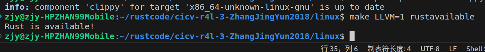

## 作业

### 1.编译一次Linux内核

1. Linux内核代码能够支持Rust
   - make LLVM=1 rustavailable
   
2. 制定编译内核的配置。
   - make menuconfig
   
3. 编译内核结果。
   - make llvm=1
    

### 2.对Linux内核进行配置

1. 问题回答。
   - Q1：在Kuild的 obj-m := r4l_e1000_demo.o 使用-M参数，决定编译成内核模块。
   - Q2：在Makefile中的KDIR ?= ../linux实现与编译内核的目录一致。

2. 实验步骤。
   1. 修改内核配置文件，移除之前的网卡驱动。
   
   2. 编译内核。
   3. 在实验目录下编译驱动名为r4l_e1000_demo的内核模块r4l_e1000_demo.ko。
   4. 执行build_image命令,启动内核。
   5. 验证之前的驱动移除是否成功。
    
   6. 验证r4l_e1000_demo驱动是否加载成功，执行ping10.0.2.2命令。
        ``` 
        insmod r4l_e1000_demo.ko
        ip link set eth0 up
        ip addr add broadcast 10.0.2.255 dev eth0
        ip addr add 10.0.2.15/255.255.255.0 dev eth0 
        ip route add default via 10.0.2.1
        ping 10.0.2.2 
        ```
       

### 3.使用rust编译一个内核模块

1. 进入到Linux目录下samples/rust文件夹
2. 添加一个rust_helloworld.rs文件，添加驱动内容
3. 修改Makefile和Kbuild文件


4. 编译内核模块（先执行menuconfig将新的驱动修改成M内核模块的编译方式）
5. 验证内核模块是否加载成功


### 4.为一个rust的驱动模块编写一个函数

### 5.实现一个简单的rust驱动模块


